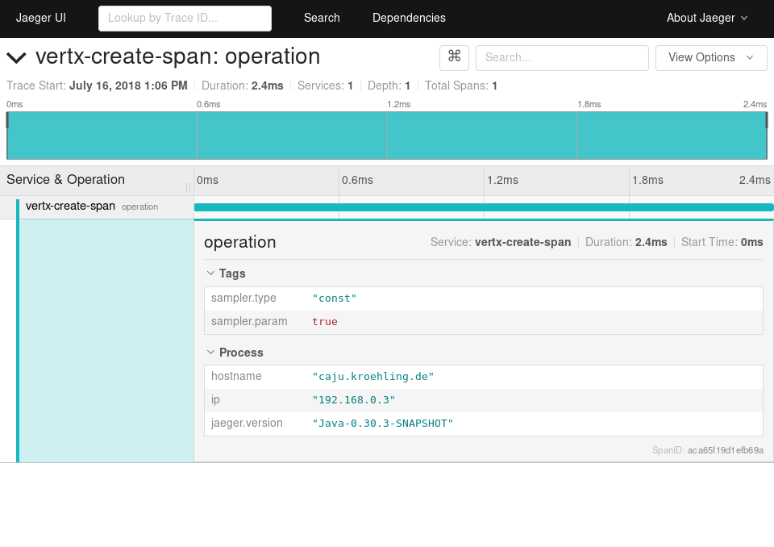

= Vert.x starter with Jaeger tracer

This is a Vert.x starter project (from http://start.vertx.io/), with
just enough code to include Jaeger tracer and report a span.

== Run

Each in a different terminal:
```
$ docker run \
  --rm \
  --name jaeger \
  -p 6831:6831/udp \
  -p 16686:16686 \
  jaegertracing/all-in-one:1.7 \
  --log-level debug
$ JAEGER_REPORTER_LOG_SPANS=true JAEGER_SAMPLER_TYPE=const JAEGER_SAMPLER_PARAM=1 ./gradlew run
$ curl localhost:8080
```

Expected outcome: 



== Docker image

```
docker build . -t ${USER}/vertx-create-span
```

== Run via Docker

```
docker run --rm ${USER}/vertx-create-span
```

== Install on Kubernetes

```
kubectl apply -f deployment.yaml
```

== Build multiple architectures

```
docker buildx build --push --platform=linux/arm64,linux/amd64,linux/s390x,linux/ppc64le ${USER}/vertx-create-span
```